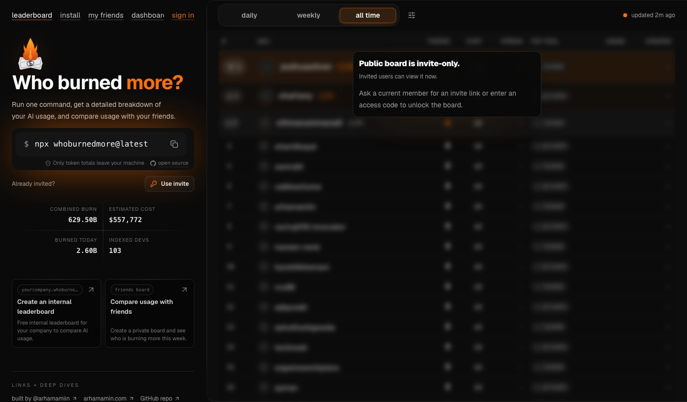

<div align="center">
  
</div>

<br>

<div align="center">

[](https://www.npmjs.com/package/whoburnedmore)
[](LICENSE)
[](https://www.npmjs.com/package/whoburnedmore)
[](package.json)

</div>

<br>

<div align="center">
  
</div>

<br>

---

One command. Your AI token burn, ranked against every developer on the board.

```bash
npx whoburnedmore
```

`whoburnedmore` reads your local AI coding-agent usage files — Claude Code, Codex, Cursor, Gemini CLI, Copilot, and a dozen more — tallies tokens and estimated cost, and posts your daily totals to [whoburnedmore.com](https://whoburnedmore.com) so you get a shareable dashboard and a rank.

**Your first run signs you in.** The CLI opens a short approval page, then binds this machine to your account. Every run after that syncs automatically in the background.

> Prefer to stay fully offline? `npx whoburnedmore --local` builds an HTML report on your machine and uploads nothing.

---

## What it reads

`whoburnedmore` uses [ccusage](https://github.com/ryoppippi/ccusage) under the hood to collect from every major agent log format in parallel:

<div align="center">

| Agent | Log source |
|---|---|
| **Claude Code** | `~/.claude/` transcripts (native reader) |
| **OpenAI Codex** | `~/.codex/` transcripts (native reader) |
| **Cursor** | Cursor session database |
| **GitHub Copilot** | Copilot usage logs |
| **Gemini CLI** | Gemini session logs |
| **OpenCode** | OpenCode logs |
| **Amp** | Amp logs |
| **Kimi CLI** | Kimi logs |
| **Qwen Code** | Qwen logs |
| **Kilo Code** | Kilo logs |
| **Goose** | Goose session files |
| **Hermes Agent** | Hermes logs |
| **Pi Agent** | Pi logs |
| **Codebuff** | Codebuff logs |
| **Droid / Openclaw** | Additional agent formats |

</div>

All sources run in parallel. The whole collection pass typically completes in under 15 seconds.

---

## Commands

<div align="center">

| Command | What it does |
|---|---|
| `npx whoburnedmore` | Sign in, collect, submit, open your dashboard |
| `npx whoburnedmore --local` | Build a local HTML dashboard — no upload, fully offline |
| `npx whoburnedmore --dry-run` | Print exactly what would be sent, send nothing |
| `npx whoburnedmore --no-submit` | Collect locally, skip the upload |
| `npx whoburnedmore --board=CODE` | Join a private friends board |
| `npx whoburnedmore --org=SLUG` | Submit to your organization's board |
| `npx whoburnedmore link --token=TOKEN` | Bind a server or VM to your account |
| `npx whoburnedmore daemon` | Keep syncing in the foreground (for containers) |
| `npx whoburnedmore install-sync` | Turn on 15-minute background sync |
| `npx whoburnedmore uninstall-sync` | Turn off background sync |
| `npx whoburnedmore private` | Hide your dashboard from the leaderboard |
| `npx whoburnedmore public` | Put it back |
| `npx whoburnedmore verify` | Delisted? Re-verify usage to get back on |
| `npx whoburnedmore remove` | Delete your dashboard and all data |
| `npx whoburnedmore status` | Check background-sync health and freshness |

</div>

After your first run, a background sync keeps your page current every 15 minutes. The installed job always pulls the latest published package, so future bug fixes apply automatically on the next tick.

---

## Privacy

`whoburnedmore` only ever sends **daily aggregate numbers**: date, tool name, model name, token counts, and estimated cost — plus optional per-session and per-tool rollups. It never sees your prompts, your code, your file paths, or any file content.

<table>
<tr>
<td width="50%">

**What leaves your machine**

- Dates (day-level granularity)
- Tool and model names
- Token counts (input / output / cache)
- Estimated cost in USD
- Optional per-session rollups

</td>
<td width="50%">

**What never leaves your machine**

- Prompt text or conversation content
- Code you wrote or generated
- File names or file paths
- Project names or repository paths
- Any personal data from your environment

</td>
</tr>
</table>

Run `private` to hide from the leaderboard, `remove` to delete all stored data, or use `--local` to stay completely offline.

The `WHOBURNEDMORE_API` environment variable overrides the server endpoint, so you can point the CLI at a self-hosted instance.

---

## Background sync

Once installed, the background sync runs `npx whoburnedmore` every 15 minutes via a launchd job (macOS) or equivalent. The job:

- Resolves to the **latest published version** on each tick — no manual updates needed
- Is **self-healing**: if the plist drifts or the node path changes, the next `install-sync` call corrects it
- Reports freshness via `whoburnedmore status` and `whoburnedmore doctor`

```bash
npx whoburnedmore install-sync    # start background sync
npx whoburnedmore status          # check last-sync time and staleness
npx whoburnedmore uninstall-sync  # stop it
```

---

## Organizations and friend boards

```bash
# Compare with specific people
npx whoburnedmore --board=INVITE_CODE

# Submit to a company or hackathon board
npx whoburnedmore --org=your-org-slug
```

Organizations get a private leaderboard at `your-org.whoburnedmore.com`, a management dashboard, and per-member roles. Friend boards are private groups you invite people into with a short code.

---

## Build

```bash
npm install
npm run build   # bundles src/ -> dist/index.js
npm test
```

---

## Open source

This repository is the exact CLI published to npm — a public, always-in-sync mirror of the production code. It contains no secrets and no server-side code, only the client that reads your local logs and talks to the public API.

The server, leaderboard, and dashboard are at [whoburnedmore.com](https://whoburnedmore.com).

---

## License

MIT — see [LICENSE](LICENSE).
